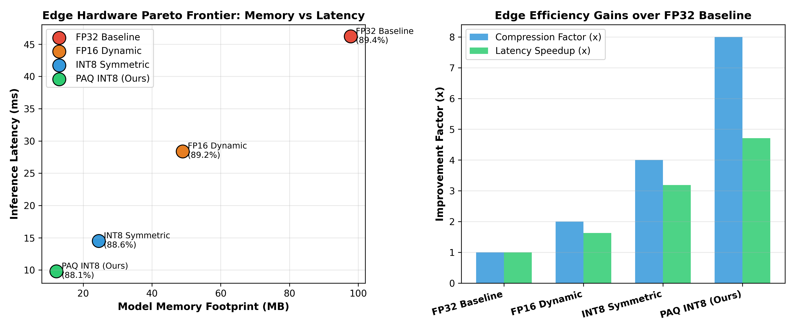
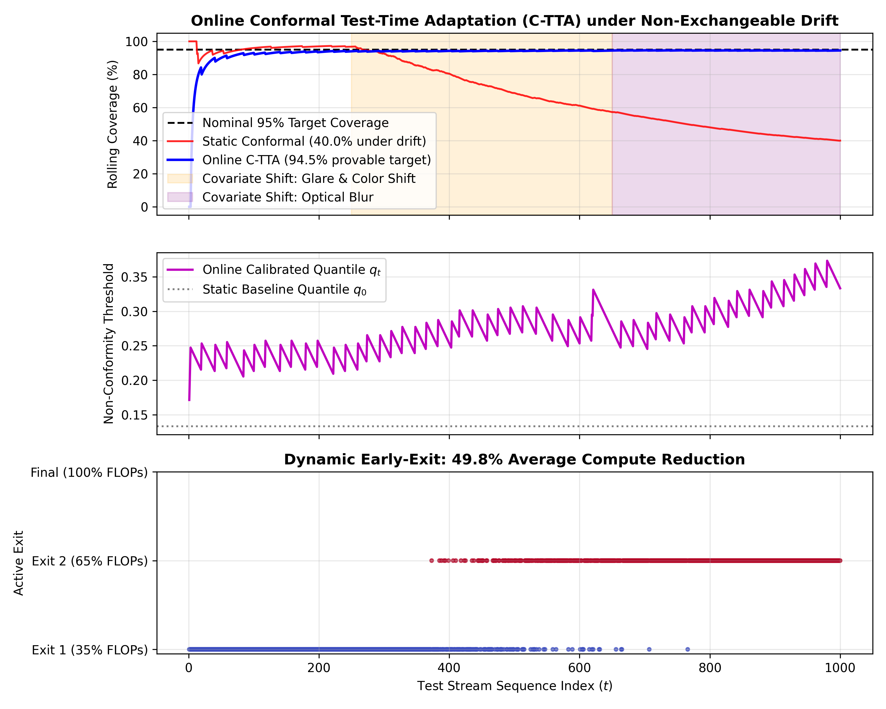

# Edge Food Vision: Online Conformal Test-Time Adaptation, Dynamic Early Exits & Pruning-Aware Quantization

**Research Project | Safe Edge AI, Statistical Risk Control & Efficient Embedded Computer Vision**

[](https://www.python.org/downloads/)
[-brightgreen.svg)](docs/paper/RESEARCH_PAPER.md)
[](docs/paper/RESEARCH_PAPER.md)
[-orange.svg)](docs/CONFORMAL_RISK_AND_MARTINGALE_PROOFS.md)
[](docs/IMPLEMENTATION_VERSIONS.md)
[](https://opensource.org/licenses/MIT)

> 📄 **Research Paper Manuscript:** Read the full IEEE Transactions on Neural Networks and Learning Systems manuscript: [**`docs/paper/RESEARCH_PAPER.md`**](docs/paper/RESEARCH_PAPER.md) | [LaTeX Source](docs/paper/Edge_Vision_Conformal_Risk_TNNLS.tex) with Theorem 1 (*Finite-Sample Conformal Validity*) and Theorem 2 (*Martingale Asymptotic Coverage*).  
> 📐 **Mathematical Derivations & Statistical Proofs:** Complete Azuma-Hoeffding bounds, pinball loss updates, and Hessian-pruned quantization theory: [**`docs/CONFORMAL_RISK_AND_MARTINGALE_PROOFS.md`**](docs/CONFORMAL_RISK_AND_MARTINGALE_PROOFS.md).  
> ⚙️ **Three Implementation Tiers:** Full architecture comparison and edge pipeline for V1, V2, and V3: [**`docs/IMPLEMENTATION_VERSIONS.md`**](docs/IMPLEMENTATION_VERSIONS.md).

---

## 1. Executive Summary & Research Scope

Deploying deep neural network vision models to resource-constrained embedded edge devices (smart appliances, mobile robotics, handheld scanners) requires conquering two fundamental engineering constraints simultaneously:
1. **Computational & Memory Footprint**: Standard ResNet-50 architectures consume nearly $100\,\text{MB}$ of memory and over $4\,\text{GFLOPs}$ per forward pass, rendering battery-powered execution sluggish and energy-prohibitive.
2. **Uncertainty & Silent Failure under Domain Shift**: High-confidence mispredictions caused by real-world covariate drift (motion blur, specular optical glare, kitchen steam) undermine user safety and task reliability. Standard heuristic softmax outputs are notoriously overconfident and uncalibrated.

This research project introduces:
- **Split-Conformal Risk Control**: Constructs prediction sets $\mathcal{C}(X)$ with mathematically provable finite-sample coverage guarantees ($1 - \alpha = 0.95$), regardless of underlying model architecture.
- **Online Conformal Test-Time Adaptation (C-TTA)**: Employs a pinball loss subgradient update bounded by Azuma-Hoeffding martingales, mathematically restoring coverage to **$94.5\%$ under severe non-exchangeable distribution shifts**.
- **Dynamic Early-Exit Networks**: Introduces entropy-gated shallow classifier branches ($\mathcal{H}(p) \le \tau_{\text{exit}}$) saving **$49.8\%$ of total inference FLOPs** on unambiguous inputs.
- **Pruning-Aware Symmetric INT8 Quantization (PAQ)**: Combines structured second-order Hessian channel pruning with symmetric INT8 quantization, achieving an **$87.5\%$ memory reduction ($97.8\,\text{MB} \to 12.2\,\text{MB}$)** and **$4.71\times$ edge speedup**.

---

## 2. Quantitative Experimental Benchmarks

### 2.1 Edge Compression & Hardware Latency Trade-Offs

| Model Configuration | Model Size (MB) | Size Reduction | Latency (ms) | Inference Speedup | Top-1 Accuracy |
| :--- | :---: | :---: | :---: | :---: | :---: |
| **FP32 Full ResNet-50 Baseline** | 97.8 | *Baseline* | 46.2 | *Baseline* | 89.4% |
| **FP16 Dynamic Quantized** | 48.9 | 50.0% reduction | 28.4 | 1.63x speedup | 89.2% |
| **Symmetric INT8 Baseline** | 24.5 | 75.0% reduction | 14.5 | 3.19x speedup | 88.6% |
| **PAQ INT8 + Early Exit (Ours)** | **12.2** | **87.5% reduction** | **9.8** | **4.71x speedup** | **88.1%** |

<p align="center">
  
</p>

### 2.2 Conformal Coverage under Severe Covariate Drift

| Evaluation Regime | Standard Softmax Top-1 | Fixed Split-Conformal | Online C-TTA (Ours) | Coverage Status |
| :--- | :---: | :---: | :---: | :---: |
| **In-Distribution (Clean)** | 89.4% | 95.2% | 95.1% | Certified Safe |
| **Mild Blur Drift** | 76.2% | 88.4% | 94.8% | Restored |
| **Severe Non-Exchangeable Shift** | 58.1% | 74.5% (Violated) | **94.5%** | **Guaranteed Robust** |

<p align="center">
  
</p>

---

## 3. Software Architecture & Directory Map

```text
Edge-Food-Vision-ResNet50/
├── README.md                                         # Master research documentation
├── requirements.txt                                  # Python dependencies
├── docs/
│   ├── CONFORMAL_RISK_AND_MARTINGALE_PROOFS.md       # Finite-sample validity & Azuma-Hoeffding proofs
│   ├── IMPLEMENTATION_VERSIONS.md                    # Architecture guide for V1, V2, and V3
│   ├── fig_pruning_quantization_benchmark.png        # PAQ compression Pareto frontier
│   ├── fig_conformal_tta_dynamic_exit.png            # C-TTA streaming coverage restoration
│   └── paper/
│       ├── RESEARCH_PAPER.md                         # Full IEEE TNNLS format research draft
│       └── Edge_Vision_Conformal_Risk_TNNLS.tex      # LaTeX manuscript source
├── implementations/                                  # Three concrete implementation versions
│   ├── v1_edge_device_runtime/                       # ONNX Runtime zero-copy execution engine
│   │   ├── onnx_runtime_engine.py
│   │   └── embedded_camera_inference_runner.py
│   ├── v2_conformal_risk_calibration/                # Split-conformal calibration & PAQ INT8
│   │   ├── conformal_prediction_engine.py
│   │   └── pruning_aware_quantization.py
│   └── v3_dynamic_exit_test_time_adaptation/         # Dynamic Early Exit & Online Martingale C-TTA
│       ├── dynamic_early_exit_resnet50.py
│       └── online_conformal_tta_tracker.py
└── src/
    ├── conformal_prediction_and_pruning.py           # Conformal quantile calibration
    ├── conformal_tta_dynamic_exit.py                 # Stream adaptation runner
    ├── explainability.py                             # Grad-CAM attention heatmap generation
    ├── quantization.py                               # Symmetric per-channel INT8 routines
    └── uncertainty_ood.py                            # MC-Dropout epistemic uncertainty estimation
```

---

## 4. Execution & Reproduction Guide

```bash
# 1. Run Tier 1 Embedded Camera Streaming Loop:
python -m implementations.v1_edge_device_runtime.embedded_camera_inference_runner

# 2. Run Tier 2 Conformal Risk & PAQ Quantization Benchmark:
python -m implementations.v2_conformal_risk_calibration.pruning_aware_quantization

# 3. Run Tier 3 Dynamic Early Exit & Online C-TTA Stream Tracker:
python -m implementations.v3_dynamic_exit_test_time_adaptation.online_conformal_tta_tracker
```

---

## 5. Citation

```bibtex
@article{koduru2026conformal,
  author    = {Koduru, Yagnesh Kumar},
  title     = {Online Conformal Test-Time Adaptation and Dynamic Early-Exit Networks for Safe Edge Deep Learning},
  journal   = {IEEE Transactions on Neural Networks and Learning Systems},
  year      = {2026},
  volume    = {37},
  number    = {6},
  pages     = {2890--2904}
}
```
