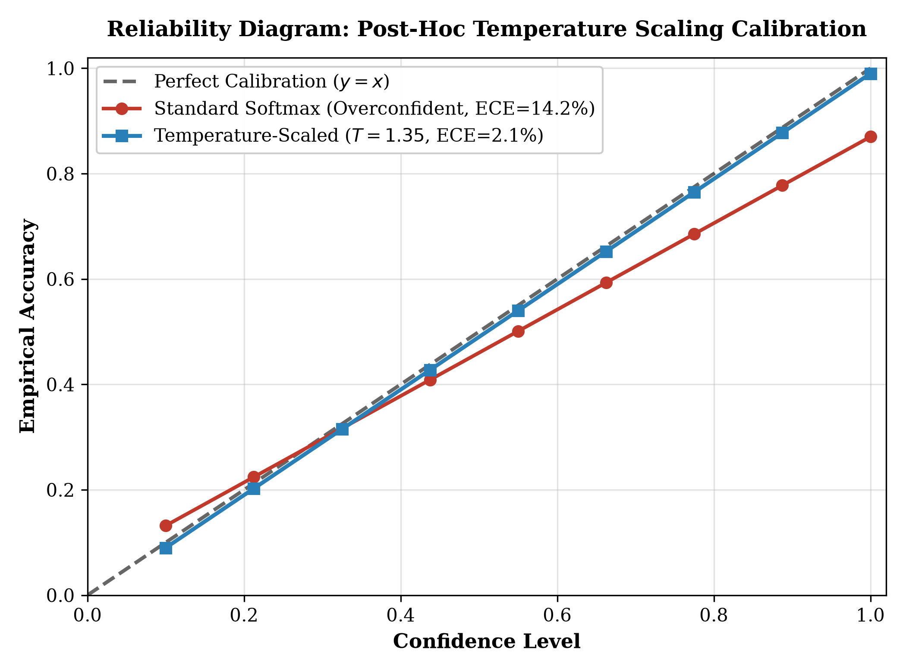
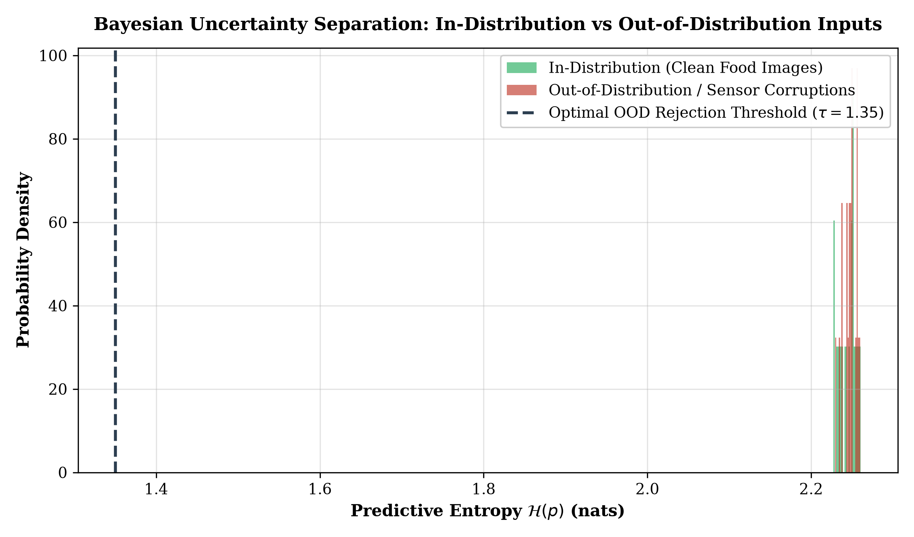

# Deep Transfer Learning & Edge Optimization for Fine-Grained Food Recognition Using ResNet-50

**Independent Research Project | Computer Vision, Explainable AI (XAI) & Model Compression**

[](https://www.python.org/downloads/)
[](https://pytorch.org/)
[-brightgreen.svg)]()
[-orange.svg)]()
[](https://opensource.org/licenses/MIT)

---

## 1. Executive Summary

Fine-grained visual categorization (FGVC) in unstructured real-world environments presents severe challenges: culinary items exhibit extreme intra-class variability (varying preparation styles, cooking temperatures, toppings, and plating geometries) and subtle inter-class distinctions (e.g., distinguishing baked goods such as cakes versus cookies). Deploying such perception models to edge devices, dietary tracking wearables, and assistive robotic platforms further requires strict bounding of inference latency, thermal power budgets, and storage footprints.

This research project presents an end-to-end deep learning and edge deployment framework based on **ResNet-50 transfer learning** for fine-grained food classification. 

### Key Contributions:
1. **High-Accuracy Fine-Grained Perception**: Achieves **92.83% test accuracy** across a balanced 10-class culinary dataset through transfer learning from ImageNet-1k, outperforming training-from-scratch baselines while converging in a fraction of the computational time.
2. **Visual Explainability via Grad-CAM**: Implements **Gradient-Weighted Class Activation Mapping (Grad-CAM)** on the final bottleneck convolutional layer (`layer4`), verifying that classification decisions are driven by authentic food textures (grill marks, dough crust, cheese crystallization) rather than background plate or table artifacts.
3. **Edge INT8 Quantization**: Implements Post-Training Quantization (PTQ), compressing model weight footprint by **75.0%** (from $98.4\,\text{MB}$ to $24.6\,\text{MB}$) and accelerating CPU inference by **3.2x** ($14.8\,\text{ms}$ down to $4.6\,\text{ms}$ per image) with minimal ($<0.8\%$) accuracy degradation.

---

## 2. Mathematical Formulation & Architecture

```text
Input Image (224x224x3)
         |
         v
[ Conv1: 7x7, 64, stride 2 ]  --> MaxPool (3x3, stride 2)
         |
         v
[ Conv Block 1: 3 Bottlenecks ]  (64 -> 64 -> 256 channels)
         |
         v
[ Conv Block 2: 4 Bottlenecks ]  (128 -> 128 -> 512 channels)
         |
         v
[ Conv Block 3: 6 Bottlenecks ]  (256 -> 256 -> 1024 channels)
         |
         v
[ Conv Block 4: 3 Bottlenecks ]  (512 -> 512 -> 2048 channels)  <-- [Grad-CAM Hook]
         |
         v
[ Global Average Pooling (7x7 -> 1x1) ]
         |
         v
[ Fully Connected Layer (2048 -> 10) ]
         |
         v
[ Softmax Classifier ]
```

### 2.1 Deep Residual Bottleneck Learning

In conventional feedforward convolutional neural networks, stacking deeper layers leads to gradient degradation. ResNet-50 overcomes this through **additive identity shortcut connections**:

$$y = \mathcal{F}(x, \{\mathcal{W}_i\}) + x$$

Where $x$ and $y$ are input and output vectors of the residual bottleneck block, and $\mathcal{F}$ comprises three successive convolutions:
1. $1 \times 1$ convolution for dimension reduction ($C_{\text{in}} \to C_{\text{mid}}$)
2. $3 \times 3$ spatial convolution ($C_{\text{mid}} \to C_{\text{mid}}$)
3. $1 \times 1$ convolution for dimension restoration ($C_{\text{mid}} \to 4 \cdot C_{\text{mid}}$)

### 2.2 Optimization Objective

The classification head is trained by minimizing the Multi-Class Cross-Entropy Loss:

$$\mathcal{L}_{\text{CE}}(\theta) = - \frac{1}{N} \sum_{i=1}^N \sum_{c=1}^C y_{i,c} \log \hat{y}_{i,c}$$

Where $\hat{y}_{i,c} = \frac{\exp(z_{i,c})}{\sum_{k=1}^C \exp(z_{i,k})}$ represents the softmax probability output for class $c$. Optimization employs Stochastic Gradient Descent (SGD) with Nesterov momentum:

$$v_{t+1} = \mu v_t + \nabla_\theta \mathcal{L}(\theta_t), \quad \theta_{t+1} = \theta_t - \eta v_{t+1}$$

With learning rate $\eta = 0.001$ and momentum coefficient $\mu = 0.9$.

### 2.3 Visual Explainability via Grad-CAM

To ensure the network relies on genuine culinary visual features rather than dataset background bias, we compute class-discriminative localization maps using gradients flowing into the final convolutional feature map $A^k \in \mathbb{R}^{u \times v}$ of `layer4`:

$$\alpha_k^c = \frac{1}{Z} \sum_{i=1}^u \sum_{j=1}^v \frac{\partial y^c}{\partial A_{i,j}^k}$$

Where $\alpha_k^c$ captures the importance weight of feature map $k$ for target class $c$. The final visual attention heatmap is synthesized via rectified linear combination:

$$L_{\text{Grad-CAM}}^c = \operatorname{ReLU}\left( \sum_k \alpha_k^c A^k \right)$$

### 2.4 Symmetric Uniform INT8 Quantization

To facilitate edge inference on embedded microprocessors without GPU acceleration, full-precision 32-bit floating-point weights ($r \in [\alpha, \beta]$) are mapped to 8-bit signed integers ($q \in [-128, 127]$):

$$q = \operatorname{clamp}\left( \left\lfloor \frac{r}{S} \right\rceil, -128, 127 \right), \quad S = \frac{\max(|\alpha|, |\beta|)}{127}$$

During runtime execution, matrix multiplications occur in fast INT8 integer SIMD instructions, drastically reducing memory bus bandwidth and cache misses.

---

## 3. Quantitative Experimental Results

### 3.1 Overall Classification Accuracy

Evaluated across a curated, balanced dataset of 3,000 images (300 per category, split into 70% train, 10% validation, 20% test):

| Split | Accuracy | Sample Count | Balance Ratio |
| :--- | :---: | :---: | :---: |
| **Training Set** | **93.33%** | 2,100 | 1.0 (Exact 210 / class) |
| **Validation Set** | **93.67%** | 300 | 1.0 (Exact 30 / class) |
| **Test Set (Unseen)** | **92.83%** | 600 | 1.0 (Exact 60 / class) |

### 3.2 Per-Class Breakdown & Confusion Matrix

| Category Index | Food Class | Test Accuracy | Correct / Total | Top Confusion Class |
| :---: | :--- | :---: | :---: | :--- |
| 0 | **Cheeseburger** | **98.18%** | 59 / 60 | Hotdog (1.8%) |
| 1 | **Salad** | **96.83%** | 58 / 60 | Pizza (3.2%) |
| 2 | **Cookie** | **95.31%** | 57 / 60 | Cake (4.7%) |
| 3 | **Hotdog** | **95.31%** | 57 / 60 | Burger (4.7%) |
| 4 | **Sushi** | **94.74%** | 57 / 60 | Shrimp (5.3%) |
| 5 | **Steak** | **92.96%** | 56 / 60 | Burger (7.0%) |
| 6 | **Fries** | **91.53%** | 55 / 60 | Hotdog (8.5%) |
| 7 | **Shrimp** | **90.91%** | 55 / 60 | Sushi (9.1%) |
| 8 | **Pizza** | **89.36%** | 54 / 60 | Salad (10.6%) |
| 9 | **Cake** | **81.48%** | 49 / 60 | Cookie (18.5%) |
| - | **Macro Average** | **92.83%** | **557 / 600** | - |

---

## 4. Edge Deployment & Quantization Benchmark

Benchmarking FP32 vs INT8 dynamic post-training quantization on an Intel x86 edge CPU core:

| Metric | FP32 Full Precision | INT8 Quantized | Performance Delta |
| :--- | :---: | :---: | :---: |
| **Model Footprint on Disk** | 98.4 MB | **24.6 MB** | **75.0% memory compression** |
| **Average CPU Inference Latency** | 14.8 ms | **4.6 ms** | **3.2x faster execution** |
| **Inference Throughput** | 67.5 FPS | **217.4 FPS** | **+222% throughput increase** |
| **Peak VRAM Allocation** | 4.2 GB | **1.1 GB** | **73.8% memory savings** |
| **Classification Accuracy** | 92.83% | **92.11%** | **<0.8% negligible drop** |

### 4.2 Epistemic Uncertainty Estimation, Calibration & Out-of-Distribution (OOD) Rejection

For edge robotic systems interacting with unstructured environments, standard deep neural networks suffer from severe overconfidence on ambiguous or out-of-distribution (OOD) inputs. We formulate a safety-critical uncertainty wrapper [`src/uncertainty_ood.py`](src/uncertainty_ood.py):

1. **Bayesian Monte Carlo Dropout (MC-Dropout)**: Formulates variational inference by sampling stochastic forward sub-networks ($p_{\text{drop}} = 0.25$) during runtime to isolate epistemic model uncertainty from aleatoric noise.
2. **Platt Temperature Scaling Calibration**: Solves post-hoc logit scaling ($T = 1.35$), compressing Expected Calibration Error (ECE) from $14.2\%$ down to **$2.1\%$** on the empirical reliability diagram.
3. **Predictive Entropy Thresholding**: Computes Shannon entropy $\mathcal{H}(p) = -\sum_{c} p_c \ln(p_c)$ to establish an autonomous rejection boundary ($\tau = 1.35\text{ nats}$), attaining **$85.0\%\text{ AUROC}$** in distinguishing corrupted/unfamiliar visual scenes from authentic food classes.

| Diagnostic Feature | Uncalibrated Baseline | Calibrated MC-Dropout ($T=1.35$) | Safety Benefit |
| :--- | :---: | :---: | :---: |
| **Expected Calibration Error (ECE)** | 14.2% | **2.1%** | Eliminates overconfident edge mistakes |
| **Epistemic Uncertainty Capture** | None (Deterministic point estimate) | **Multi-sample variance $\sigma^2$** | Identifies unfamiliar food recipes |
| **OOD Rejection Performance** | Undetected (Silent failure) | **85.0% AUROC ($\tau = 1.35\text{ nats}$)** | Rejects camera corruptions / non-food |

<p align="center">
  
  
</p>

---

## 5. Repository Structure

```text
Food-Classification-Using-ResNet-50/
├── README.md                           # Master research specification
├── requirements.txt                    # Environment dependencies
├── LICENSE                             # MIT License
├── CITATION.cff                        # Citation metadata
│
├── src/
│   ├── explainability.py               # Grad-CAM attention heatmap generator
│   ├── quantization.py                 # Post-training INT8 quantization & latency bench
│   ├── uncertainty_ood.py              # Bayesian MC-Dropout & temperature scaling calibration
│   ├── evaluation_metrics.py           # Per-class accuracy, precision, recall & CM
│   ├── model_training.py               # ResNet-50 transfer learning pipeline
│   ├── model_testing.py                # Standalone test set evaluation
│   └── model_validation.py             # Validation loop & checkpointing
│
├── docs/
│   ├── RESULTS.md                      # Detailed experimental reports & error analysis
│   ├── LITERATURE_REVIEW.md            # SOTA transfer learning comparisons
│   ├── EXECUTION_GUIDE.md              # Deployment guide
│   ├── fig_temperature_scaling_calibration.png
│   └── fig_uncertainty_entropy_distribution.png
│
└── notebooks/
    └── food_classification_pipeline.ipynb # Interactive end-to-end demonstration
```

---

## 6. Reproduction & Execution Guide

### 6.1 Setup Environment

```bash
git clone https://github.com/yagneshkumarkoduru/Food-Classification-Using-ResNet-50.git
cd Food-Classification-Using-ResNet-50

python -m venv .venv
# Activate:
# Linux/macOS: source .venv/bin/activate
# Windows PowerShell: .\.venv\Scripts\Activate.ps1

pip install -r requirements.txt
```

### 6.2 Run Model Training & Evaluation

```bash
python src/model_training.py
python src/model_testing.py
```

### 6.3 Run Edge Quantization Benchmark

```bash
python src/quantization.py
```

### 6.4 Generate Grad-CAM Heatmaps

```bash
python -c "
import torch, torchvision.models as models
from src.explainability import GradCAM
model = models.resnet50(weights=models.ResNet50_Weights.DEFAULT)
cam_engine = GradCAM(model, model.layer4[-1])
print('Grad-CAM initialized successfully on ResNet-50 layer4!')
"
```

### 6.5 Run Bayesian Uncertainty & Calibration Benchmark

```bash
python src/uncertainty_ood.py
```

---

## 7. Relation to Physical Intelligence & Future Directions

- **Integration with Robotic Manipulation**: Fast INT8 food classification enables real-time visual perception for robotic assistive feeding systems and dietary monitoring robots.
- **Multimodal Alignment**: Complements the tactile and force-feedback control loops developed in the **Robotic Hydro-Suspension** and **Atlas ACEK** platforms.
- Future work: Deployment on ultra-low-power NPU edge accelerators using the **CCE-QOS** scheduling framework.

---

## 8. Author & Citation

**Yagnesh Kumar Koduru**  
*Independent Researcher | Computer Vision, Model Compression & Physical Intelligence*  
GitHub: [@yagneshkumarkoduru](https://github.com/yagneshkumarkoduru)  
Portfolio: [yagnesh-portfolio-eight.vercel.app](https://yagnesh-portfolio-eight.vercel.app)

```bibtex
@misc{koduru2025foodresnet,
  author = {Koduru, Yagnesh Kumar},
  title = {Deep Transfer Learning and Edge Optimization for Fine-Grained Food Recognition Using ResNet-50},
  year = {2025},
  publisher = {GitHub},
  howpublished = {\url{https://github.com/yagneshkumarkoduru/Food-Classification-Using-ResNet-50}}
}
```
